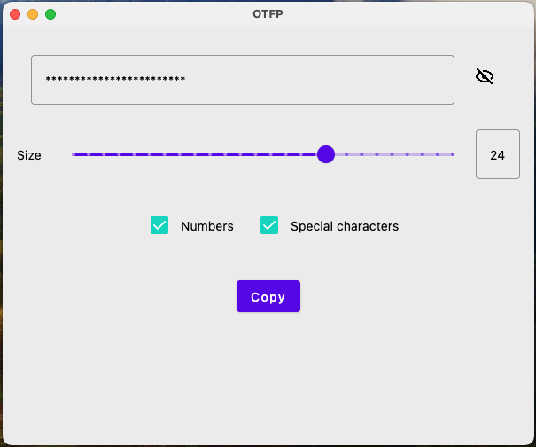

# Password Generator App: Generate and Forget

Welcome to the Password Generator App, your solution for quickly generating secure passwords and forgetting about them with ease. Built using Jetpack Compose, a cutting-edge UI toolkit for native Android apps, this application streamlines the process of creating random strings, ideal for secrets, salts, or any other confidential data you may need in your job.

## The Need for Quick, Secure Solutions
In our fast-paced work environments, it's common to require random strings for various purposes. However, constantly generating and managing these strings can be tedious and time-consuming. That's where our Password Generator App comes in handy. With its intuitive interface and powerful features, it simplifies the task of creating and using random strings, allowing you to focus on your work without worrying about security or complexity.

## Features

- Password Generation: Users can generate passwords of variable lengths.
- Customization: Users can choose to include numbers and special characters in their generated passwords.
- Password Visibility Toggle: The application provides an option to toggle password visibility for ease of copying.
- Copy to Clipboard: Users can copy the generated password to the clipboard with a single click.

## How to Use

- Password Length: Adjust the slider or input the desired length in the text field to set the length of the password.
- Include Numbers: Toggle the checkbox to include numbers in the generated password.
- Include Special Characters: Toggle the checkbox to include special characters in the generated password.
- Copy Password: Click the "Copy" button to copy the generated password to the clipboard.
- Password Visibility: Click the eye icon to toggle password visibility between obscured and visible.

## Running the Application

To run the application, ensure you have Android Studio installed with the necessary dependencies. Open the project in Android Studio and run it on an emulator or a physical device.

## Development Setup

This application is built using Jetpack Compose, Kotlin, and Android Studio. To contribute or modify the application:

- Clone the repository: git clone https://github.com/your/repository.git
- Open the project in Android Studio or Inteliji IDEA.
- Make your desired changes or enhancements.

## Test the application thoroughly.

Submit a pull request with your changes for review.

## Acknowledgments

Special thanks to the JetBrains Compose team for developing Jetpack Compose and providing resources for building modern Android UIs.

## License

This project is licensed under the MIT License - see the LICENSE file for details.

## Author
Alex Scrobot - [LinkedIn](https://www.linkedin.com/in/scrobot/)

Feel free to reach out with any questions, suggestions, or feedback!